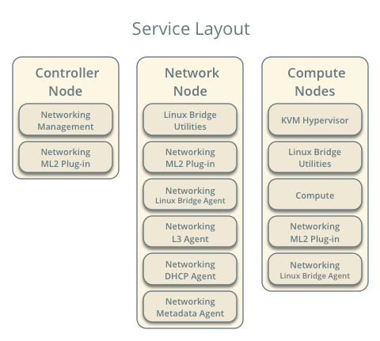
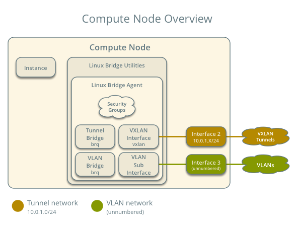
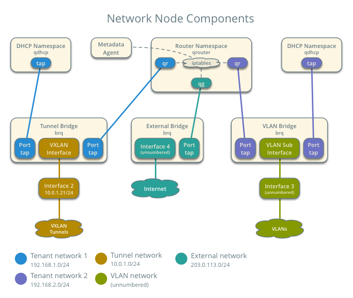
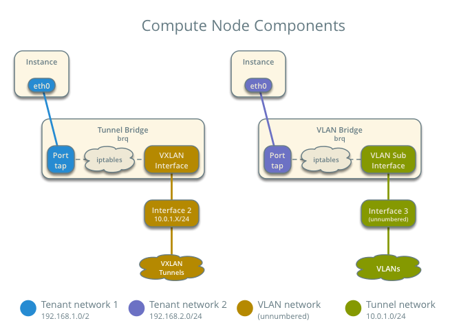
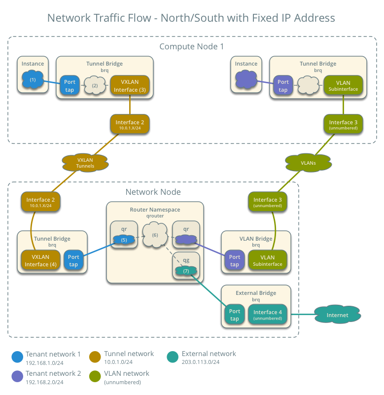
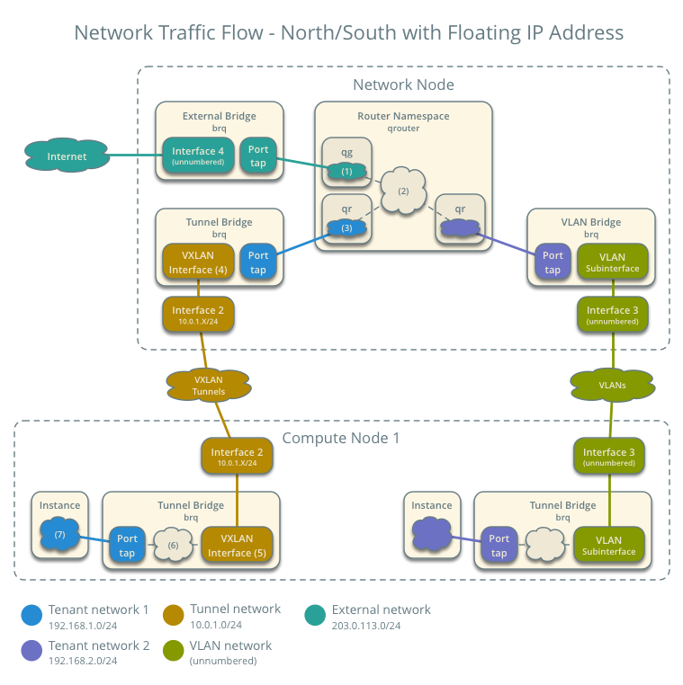
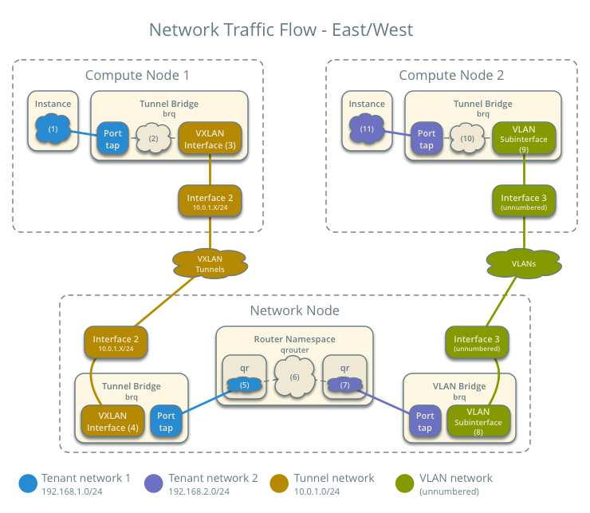

# Scenario: Legacy implementation with Linux Bridge

This scenario describes a legacy (basic) implementation of the
OpenStack Networking service using the ML2 plug-in with Linux Bridge.
The example configuration creates one flat external network and VXLAN
tenant networks. However, this configuration also supports VLAN
external and tenant networks. The Linux Bridge mechanism does not
support GRE tenant networks.

To improve understanding of network traffic flow, the network and compute
nodes contain a separate network interface for tenant VLAN networks. In
production environments, tenant VLAN networks can use any network interface.

## Requirements

1. One controller node with one network interface: management.

1. One network node with four network interfaces: management, tenant tunnel
   networks, tenant VLAN networks, and external (typically the Internet).

1. At least one compute nodes with three network interfaces: management,
   tenant tunnel networks, and tenant VLAN networks.


Note: For VLAN external and tenant networks, the network infrastructure
must support VLAN tagging. For best performance with VXLAN tenant networks,
the network infrastructure should support jumbo frames.

**Warning: Proper operation of VXLAN requires kernel 3.13 or newer. In
general, only Ubuntu 14.04, Fedora 20, and Fedora 21 meet or exceed this
minimum version requirement when using packages rather than source.**

## Prerequisites

1. Controller node

  1. Operational SQL server with `neutron` database and appropriate
     configuration in the neutron-server.conf file.

  1. Operational message queue service with appropriate configuration
     in the neutron-server.conf file.

  1. Operational OpenStack Identity service with appropriate configuration
     in the neutron-server.conf file.

  1. Operational OpenStack Compute controller/management service with
     appropriate configuration to use neutron in the nova.conf file.

  1. Neutron server service, ML2 plug-in, and any dependencies.

1. Network node

  1. Operational OpenStack Identity service with appropriate configuration
     in the neutron-server.conf file.

  1. Open vSwitch service, ML2 plug-in, Linux Bridge agent, L3 agent,
     DHCP agent, metadata agent, and any dependencies including the
     `ipset` utility.

1. Compute nodes

  1. Operational OpenStack Identity service with appropriate configuration
     in the neutron-server.conf file.

  1. Operational OpenStack Compute controller/management service with
     appropriate configuration to use neutron in the nova.conf file.

  1. Open vSwitch service, ML2 plug-in, Linux Bridge agent, and any
     dependencies including the `ipset` utility.



## Architecture

### General

The legacy architecture provides basic virtual networking components in
your environment. Routing among tenant and external networks resides
completely on the network node. Although more simple to deploy than
other architectures, performing all functions on the network node
creates a single point of failure and potential performance issues.
Consider deploying DVR or L3 HA architectures in production environments
to provide redundancy and increase performance. However, the DVR and L3
HA architectures require Open vSwitch.


The network node runs the Linux Bridge agent, L3 agent, DHCP agent, and
metadata agent.


The compute nodes run the Linux Bridge agent.



### Components

The network node contains the following components:

1. Linux Bridge agent managing virtual switches, connectivity among
   them, and interaction via virtual ports with other network components
   such as namespaces and underlying interfaces.

1. DHCP agent managing the `qdhcp` namespaces.

  1. The `qdhcp` namespaces provide DHCP services for instances using 
     tenant networks.

1. L3 agent managing the `qrouter` namespaces.

  1. The `qrouter` namespaces provide routing between tenant and external
     networks and among tenant networks. They also route metadata traffic
     between instances and the metadata agent.

1. Metadata agent handling metadata operations.

  1. The metadata agent handles metadata operations for instances.



The compute nodes contain the following components:

1. Linux Bridge agent managing virtual switches, connectivity among
   them, and interaction via virtual ports with other network components
   such as namespaces, security groups, and underlying interfaces.



## Packet flow

### Case 1: North-south for instances without a floating IP address

For instances without a floating IP address, the network node routes
*north-south* network traffic between tenant and external networks.

Note: The term *north-south* generally defines network traffic that
travels between tenant and external networks (typically the Internet).

#### Example environment configuration

Instance 1 resides on compute node 1 and uses tenant network 1.
The instance sends a packet to a host on the external network.

* External network 1

  * Network 203.0.113.0/24

  * Gateway 203.0.113.1 with MAC address *EG1*

  * Floating IP range 203.0.113.101 to 203.0.113.200

  * Tenant network 1 router interface 203.0.113.101 *TR1*

* Tenant network 1

  * Network 192.168.1.0/24

  * Gateway 192.168.1.1 with MAC address *TG1*

* Compute node 1

  * Instance 1 192.168.1.11 with MAC address *I1*

#### Packet flow

Although the diagram shows both VXLAN and VLAN tenant networks, the packet
flow only considers one active VXLAN tenant network. The unlabeled components
in the diagram exist to enhance visualization of the architecture.

The following steps involve compute node 1.

1. For VXLAN tenant networks:

  1. The instance 1 `tap` interface (1) forwards the packet to the tunnel
     bridge `qbr`. The packet contains destination MAC address *TG1*
     because the destination resides on another network.

  1. Security group rules (2) on the tunnel bridge `qbr` handle state
     tracking for the packet.

  1. The tunnel bridge `qbr` forwards the packet to the logical tunnel
     interface `vxlan-sid` (3) where *sid* contains the tenant network
     segmentation ID.

  1. The physical tunnel interface forwards the packet to the network
     node.

1. For VLAN tenant networks:

  1. The instance 1 `tap` interface forwards the packet to the VLAN
     bridge `qbr`. The packet contains destination MAC address *TG1*
     because the destination resides on another network.

  1. Security group rules on the VLAN bridge `qbr` handle state tracking
     for the packet.

  1. The VLAN bridge `qbr` forwards the packet to the logical VLAN
     interface `device.sid` where *device* references the underlying
     physical VLAN interface and *sid* contains the tenant network
     segmentation ID.

  1. The logical VLAN interface `device.sid` forwards the packet to the
     network node via the physical VLAN interface.

The following steps involve the network node.

1. For VXLAN tenant networks:

  1. The physical tunnel interface forwards the packet to the logical
     tunnel interface `vxlan-sid` (4) where *sid* contains the tenant
     network segmentation ID.

  1. The logical tunnel interface `vxlan-sid` forwards the packet to the
     tunnel bridge `qbr`.

  1. The tunnel bridge `qbr` forwards the packet to the `qr` interface (5)
     in the router namespace `qrouter`. The `qr` interface contains the
     tenant network 1 router interface IP address *TG1*.

1. For VLAN tenant networks:

  1. The physical VLAN interface forwards the packet to the logical VLAN
     interface `device.sid` where *device* references the underlying
     physical VLAN interface and *sid* contains the tenant network
     segmentation ID.

  1. The logical VLAN interface `device.sid` forwards the packet to the
     VLAN bridge `qbr`.

  1. The VLAN bridge `qbr` forwards the packet to the `qr` interface in
     the router namespace `qrouter`. The `qr` interface contains the
     tenant network 1 gateway IP address *TG1*.

1. The *iptables* service (6) performs SNAT on the packet using the `qg`
   interface (7) as the source IP address. The `qg` interface contains
   the tenant network 1 router interface IP address *TR1*.

1. The router namespace `qrouter` forwards the packet to the external
   bridge `qbr`.

1. The external bridge `qbr` forwards the packet to the external network
   via the physical external interface.

Note: Return traffic follows similar steps in reverse.



### Case 2: North-south for instances with a floating IP address

For instances with a floating IP address, the network node routes
*north-south* network traffic between tenant and external networks.

#### Example environment configuration

Instance 1 resides on compute node 1 and uses tenant network 1.
The instance receives a packet from a host on the external network.

* External network 1

  * Network 203.0.113.0/24

  * Gateway 203.0.113.1 with MAC address *EG1*

  * Floating IP range 203.0.113.101 to 203.0.113.200

  * Tenant network 1 router interface 203.0.113.101 *TR1*

* Tenant network 1

  * Network 192.168.1.0/24

  * Gateway 192.168.1.1 with MAC address *TG1*

* Compute node 1

  * Instance 1 192.168.1.11 with MAC address *I1* and floating
   IP address 203.0.113.102 *F1*

#### Packet flow

Although the diagram shows both VXLAN and VLAN tenant networks, the packet
flow only considers one active VXLAN tenant network. The unlabeled components
in the diagram exist to enhance visualization of the architecture.

The following steps involve the network node.

1. The physical external interface forwards the packet to the external
   bridge `qbr`.

1. The external bridge `qbr` forwards the packet to the `qg` interface (1)
   in the router namespace `qrouter`. The `qg` interface contains the
   instance floating IP address *F1*.

1. The *iptables* service (2) performs DNAT on the packet using the `qr`
   interface (3) as the source IP address. The `qr` interface contains the
   tenant network 1 gateway IP address *TR1*.

1. For VXLAN tenant networks:

  1. The router namespace `qrouter` forwards the packet to the tunnel
     bridge `qbr`.

  1. The tunnel bridge `qbr` forwards the packet to the logical tunnel
     interface `vxlan-sid` (4) where *sid* contains the tenant network
     segmentation ID.

  1. The physical tunnel interface forwards the packet to compute node 1.

1. For VLAN tenant networks:

  1. The router namespace `qrouter` forwards the packet to the VLAN
     bridge `qbr`.

  1. The VLAN bridge `qbr` forwards the packet to the logical VLAN
     interface `device.sid` where *device* references the underlying
     physical VLAN interface and *sid* contains the tenant network
     segmentation ID.

  1. The physical VLAN interface forwards the packet to compute node 1.

The following steps involve compute node 1.

1. For VXLAN tenant networks:

  1. The physical tunnel interface forwards the packet to the logical
     tunnel interface `vxlan-sid` (5) where *sid* contains the tenant
     network segmentation ID.

  1. The logical tunnel interface `vxlan-sid` forwards the packet to the
     tunnel bridge `qbr`.

  1. Security group rules (6) on the tunnel bridge `qbr` handle firewalling
     and state tracking for the packet.

  1. The tunnel bridge `qbr` forwards the packet to the `tap` interface (7)
     on instance 1.

1. For VLAN tenant networks:

  1. The physical VLAN interface forwards the packet to the logical
     VLAN interface `device.sid` where *device* references the underlying
     physical VLAN interface and *sid* contains the tenant network
     segmentation ID.

  1. The logical VLAN interface `device.sid` forwards the packet to the
     VLAN bridge `qbr`.

  1. Security group rules on the VLAN bridge `qbr` handle firewalling
     and state tracking for the packet.

  1. The VLAN bridge `qbr` forwards the packet to the `tap` interface
     on instance 1.

Note: Return traffic follows similar steps in reverse.



### Case 3: East-west for instances with or without a floating IP address

For instances with or without a floating IP address, the network node
routes *east-west* network traffic among tenant networks using the
same router.

Note: The term *east-west* generally defines network traffic that
travels between instances, typically on different tenant networks.

#### Example environment configuration

Instance 1 resides on compute node 1 and uses tenant VXLAN network 1.
Instance 2 resides on compute node 2 and uses tenant VLAN network 2. Both
tenant networks reside on the same router. Instance 1 sends a packet to
instance 2.

* Tenant network 1

  * Network: 192.168.1.0/24

  * Gateway: 192.168.1.1 with MAC address *TG1*

* Tenant network 2

  * Network: 192.168.2.0/24

  * Gateway: 192.168.2.1 with MAC address *TG2*

* Compute node 1

  * Instance 1: 192.168.1.11 with MAC address *I1*

* Compute node 2

  * Instance 2: 192.168.2.11 with MAC address *I2*

#### Packet flow

The following steps involve compute node 1:

1. For VXLAN tenant networks:

  1. The instance 1 `tap` interface (1) forwards the packet to the tunnel
     bridge `qbr`. The packet contains destination MAC address *TG1*
     because the destination resides on another network.

  1. Security group rules (2) on the tunnel bridge `qbr` handle state tracking
     for the packet.

  1. The tunnel bridge `qbr` forwards the packet to the logical tunnel
     interface `vxlan-sid` (3) where *sid* contains the tenant network
     segmentation ID.

  1. The physical tunnel interface forwards the packet to the network
     node.

1. For VLAN tenant networks:

  1. The instance 1 `tap` interface forwards the packet to the VLAN
     bridge `qbr`. The packet contains destination MAC address *TG1*
     because the destination resides on another network.

  1. Security group rules on the VLAN bridge `qbr` handle state tracking
     for the packet.

  1. The VLAN bridge `qbr` forwards the packet to the logical VLAN
     interface `device.sid` where *device* references the underlying
     physical VLAN interface and *sid* contains the tenant network
     segmentation ID.

  1. The logical VLAN interface `device.sid` forwards the packet to the
     network node via the physical VLAN interface.

The following steps involve the network node.

1. For VXLAN tenant networks:

  1. The physical tunnel interface forwards the packet to the logical
     tunnel interface `vxlan-sid` (4) where *sid* contains the tenant
     network segmentation ID.

  1. The logical tunnel interface `vxlan-sid` forwards the packet to the
     tunnel bridge `qbr`.

  1. The tunnel bridge `qbr` forwards the packet to the `qr-1` interface (5)
     in the router namespace `qrouter`. The `qr-1` interface contains the
     tenant network 1 gateway IP address *TG1*.

1. For VLAN tenant networks:

  1. The physical VLAN interface forwards the packet to the logical
     VLAN interface `device.sid` where *device* references the underlying
     physical VLAN interface and *sid* contains the tenant network
     segmentation ID.

  1. The logical VLAN interface `device.sid` forwards the packet to the
     VLAN bridge `qbr`.

  1. The VLAN bridge `qbr` forwards the packet to the `qr-1` interface in
     the router namespace `qrouter`. The `qr-1` interface contains the
     tenant network 1 gateway IP address *TG1*.

1. The router namespace `qrouter` routes the packet (6) to the `qr-2`
   interface (7). The The `qr-2` interface contains the tenant network 2
   gateway IP address *TG2*.

1. For VXLAN tenant networks:

  1. The router namespace `qrouter` forwards the packet to the tunnel
     bridge `qbr`.

  1. The tunnel bridge `qbr` forwards the packet to the logical tunnel
     interface `vxlan-sid` where *sid* contains the tenant network
     segmentation ID.

  1. The physical tunnel interface forwards the packet to compute node 2.

1. For VLAN tenant networks:

  1. The router namespace `qrouter` forwards the packet to the VLAN
     bridge `qbr`.

  1. The VLAN bridge `qbr` forwards the packet to the logical VLAN
     interface `vlan.sid` (8) where *sid* contains the tenant network
     segmentation ID.

  1. The physical VLAN interface forwards the packet to compute node 2.

The following steps involve compute node 2:

1. For VXLAN tenant networks:

  1. The physical tunnel interface forwards the packet to the logical
     tunnel interface `vxlan-sid` where *sid* contains the tenant network
     segmentation ID.

  1. The logical tunnel interface `vxlan-sid` forwards the packet to the
     tunnel bridge `qbr`.

  1. Security group rules on the tunnel bridge `qbr` handle firewalling
     and state tracking for the packet.

  1. The tunnel bridge `qbr` forwards the packet to the `tap` interface
     on instance 2.

1. For VLAN tenant networks:

  1. The physical VLAN interface forwards the packet to the logical VLAN
     interface `vlan.sid` (9) where *sid* contains the tenant network
     segmentation ID.

  1. The logical VLAN interface `vlan.sid` forwards the packet to the
     VLAN bridge `qbr`.

  1. Security group rules (10) on the VLAN bridge `qbr` handle firewalling
     and state tracking for the packet.

  1. The VLAN bridge `qbr` forwards the packet to the `tap` interface (11)
     on instance 2.

Note: Return traffic follows similar steps in reverse.



## Configuration

### Controller node (controller)

The controller node provides the neutron API and manages services on the
other nodes.

1. Configure base options.

   1. Edit the /etc/neutron/neutron.conf file.

    ```
    [DEFAULT]
    verbose = True
    core_plugin = ml2
    service_plugins = router
    allow_overlapping_ips = True

    notify_nova_on_port_status_changes = True
    notify_nova_on_port_data_changes = True
    nova_url = http://controller:8774/v2
    nova_region_name = regionOne
    nova_admin_username = NOVA_ADMIN_USERNAME
    nova_admin_tenant_id = NOVA_ADMIN_TENANT_ID
    nova_admin_password =  NOVA_ADMIN_PASSWORD
    nova_admin_auth_url = http://controller:35357/v2.0
    ```

  Note: Replace NOVA_ADMIN_USERNAME, NOVA_ADMIN_TENANT_ID, and
  NOVA_ADMIN_PASSWORD with suitable values for your environment.

1. Configure the ML2 plug-in.

  1. Edit the /etc/neutron/plugins/ml2/ml2_conf.ini file.

    ```
    [ml2]
    type_drivers = flat,vlan,vxlan
    tenant_network_types = vlan,vxlan
    mechanism_drivers = linuxbridge,l2population

    [ml2_type_flat]
    flat_networks = external

    [ml2_type_vlan]
    network_vlan_ranges = vlan:1:1000

    [ml2_type_vxlan]
    vni_ranges = 1:1000
    vxlan_group = 239.1.1.1

    [securitygroup]
    enable_security_group = True
    firewall_driver = neutron.agent.linux.iptables_firewall.IptablesFirewallDriver
    enable_ipset = True
    ```

  Note: The first value in the 'tenant_network_types' option becomes the
  default tenant network type when a non-privileged user creates a network.

  Note: Adjust the VLAN tag and VXLAN tunnel ID ranges for your
  environment.

1. Start the following services:

  * Server

### Network node (network1)

The network node provides DHCP and NAT services to all instances.

1. Configure base options.

  1. Edit the /etc/neutron/neutron.conf file.

    ```
    [DEFAULT]
    verbose = True
    core_plugin = ml2
    service_plugins = router
    allow_overlapping_ips = True
    ```

1. Configure the ML2 plug-in.

  1. Edit the /etc/neutron/plugins/ml2/ml2_conf.ini file.

    ```
    [ml2]
    type_drivers = flat,vlan,vxlan
    tenant_network_types = vlan,vxlan
    mechanism_drivers = linuxbridge,l2population

    [ml2_type_flat]
    flat_networks = external

    [ml2_type_vlan]
    network_vlan_ranges = vlan:1:1000

    [ml2_type_vxlan]
    vni_ranges = 1:1000
    vxlan_group = 239.1.1.1

    [securitygroup]
    enable_security_group = True
    enable_ipset = True
    firewall_driver = neutron.agent.linux.iptables_firewall.IptablesFirewallDriver

    [linux_bridge]
    physical_interface_mappings = vxlan:TENANT_TUNNEL_INTERFACE,vlan:TENANT_VLAN_INTERFACE,external:EXTERNAL_NETWORK_INTERFACE

    [vlans]
    tenant_network_type = vlan
    network_vlan_ranges = vlan:1:1000

    [vxlan]
    enable_vxlan = True
    local_ip = TENANT_TUNNEL_INTERFACE_IP_ADDRESS
    l2_population = True
    ```

  Note: Adjust the VLAN tag and VXLAN tunnel ID ranges for your
  environment.

  Note: The first value in the 'tenant_network_types' option becomes the
  default tenant network type when a non-privileged user creates a network.

  Note: Replace TENANT_TUNNEL_INTERFACE, TENANT_VLAN_INTERFACE, and
  EXTERNAL_NETWORK_INTERFACE with the respective underlying network
  interface names. For example, eth1, eth2, and eth3. Replace
  TENANT_TUNNEL_INTERFACE_IP_ADDRESS with the IP address of the tenant
  tunnel network interface.

1. Configure the L3 agent.

  1. Edit the /etc/neutron/l3_agent.ini file.

    ```
    [DEFAULT]
    verbose = True
    interface_driver = neutron.agent.linux.interface.BridgeInterfaceDriver
    use_namespaces = True
    external_network_bridge =
    router_delete_namespaces = True
    ```

1. Configure the DHCP agent.

  1. Edit the /etc/neutron/dhcp_agent.ini file.

    ```
    [DEFAULT]
    verbose = True
    interface_driver = neutron.agent.linux.interface.BridgeInterfaceDriver
    dhcp_driver = neutron.agent.linux.dhcp.Dnsmasq
    use_namespaces = True
    dhcp_delete_namespaces = True
    ```

  1. (Optional) Reduce MTU for VXLAN tenant networks.

    1. Edit the /etc/neutron/dhcp_agent.ini file.

    ```
    [DEFAULT]
    dnsmasq_config_file = /etc/neutron/dnsmasq-neutron.conf
    ```

    1. Edit the /etc/neutron/dnsmasq-neutron.conf file.

    ```
    dhcp-option-force=26,1450
    ```

1. Configure the metadata agent.

  1. Edit the /etc/neutron/metadata_agent.ini file.

    ```
    [DEFAULT]
    verbose = True
    auth_url = http://controller:5000/v2.0
    auth_region = regionOne
    admin_tenant_name = ADMIN_TENANT_NAME
    admin_user = ADMIN_USER
    admin_password = ADMIN_PASSWORD
    nova_metadata_ip = controller
    metadata_proxy_shared_secret = METADATA_SECRET
    ```

  Note: Replace ADMIN_TENANT_NAME, ADMIN_USER, ADMIN_PASSWORD, and
  METADATA_SECRET with suitable values for your environment.

1. Start the following services:

  * Linux Bridge agent
  * L3 agent
  * DHCP agent
  * Metadata agent

### Compute nodes (compute1 and compute2)

The compute nodes provide switching services and handle security groups
for instances.

1. Configure base options.

  1. Edit the /etc/neutron/neutron.conf file.

    ```
    [DEFAULT]
    verbose = True
    core_plugin = ml2
    service_plugins = router
    allow_overlapping_ips = True
    ```

1. Configure the ML2 plug-in.

  1. Edit the /etc/neutron/plugins/ml2/ml2_conf.ini file.

    ```
    [ml2]
    type_drivers = flat,vlan,vxlan
    tenant_network_types = vlan,vxlan
    mechanism_drivers = linuxbridge,l2population

    [ml2_type_vlan]
    network_vlan_ranges = vlan:1:1000

    [ml2_type_vxlan]
    vni_ranges = 1:1000
    vxlan_group = 239.1.1.1

    [securitygroup]
    enable_security_group = True
    enable_ipset = True
    firewall_driver = neutron.agent.linux.iptables_firewall.IptablesFirewallDriver

    [linux_bridge]
    physical_interface_mappings = vxlan:TENANT_TUNNEL_INTERFACE,vlan:TENANT_VLAN_INTERFACE

    [vlans]
    tenant_network_type = vlan
    network_vlan_ranges = vlan:1:1000

    [vxlan]
    enable_vxlan = True
    local_ip = TENANT_TUNNEL_INTERFACE_IP_ADDRESS
    l2_population = True
    ```

  Note: The first value in the 'tenant_network_types' option becomes the
  default tenant network type when a non-privileged user creates a network.

  Note: Adjust the VLAN tag and VXLAN tunnel ID ranges for your
  environment.

  Note: Replace TENANT_TUNNEL_INTERFACE, TENANT_VLAN_INTERFACE, and
  EXTERNAL_NETWORK_INTERFACE with the respective underlying network
  interface names. For example, eth1 and eth2. Replace
  TENANT_TUNNEL_INTERFACE_IP_ADDRESS with the IP address of the tenant
  tunnel network interface.

1. Start the following services:

  * Linux Bridge agent

### Verify service operation

1. Source the administrative tenant credentials.

1. Verify presence and operation of the agents.

  ```
  # neutron agent-list
  +--------------------------------------+--------------------+-------------+-------+----------------+---------------------------+
  | id                                   | agent_type         | host        | alive | admin_state_up | binary                    |
  +--------------------------------------+--------------------+-------------+-------+----------------+---------------------------+
  | 0146e482-f94a-4996-9e2a-f0cafe2575c5 | L3 agent           | network1    | :-)   | True           | neutron-l3-agent          |
  | 0dd4af0d-aafd-4036-b240-db12cf2a1aa9 | Linux bridge agent | compute2    | :-)   | True           | neutron-linuxbridge-agent |
  | 2f9e5434-575e-4079-bcca-5e559c0a5ba7 | Linux bridge agent | network1    | :-)   | True           | neutron-linuxbridge-agent |
  | 4105fd85-7a8f-4956-b104-26a600670530 | Linux bridge agent | compute1    | :-)   | True           | neutron-linuxbridge-agent |
  | 8c15992a-3abc-4b14-aebc-60065e5090e6 | Metadata agent     | network1    | :-)   | True           | neutron-metadata-agent    |
  | aa2e8f3e-b53e-4fb9-8381-67dcad74e940 | DHCP agent         | network1    | :-)   | True           | neutron-dhcp-agent        |
  +--------------------------------------+--------------------+-------------+-------+----------------+---------------------------+
  ```

## Create initial networks

### External (flat) network

1. Source the administrative tenant credentials.

1. Create the external network.

  ```
  $ neutron net-create ext-net --router:external True \
    --provider:physical_network external --provider:network_type flat
  Created a new network:
  +---------------------------+--------------------------------------+
  | Field                     | Value                                |
  +---------------------------+--------------------------------------+
  | admin_state_up            | True                                 |
  | id                        | d57703fd-5571-404c-abca-f59a13f3c507 |
  | name                      | ext-net                              |
  | provider:network_type     | flat                                 |
  | provider:physical_network | external                             |
  | provider:segmentation_id  |                                      |
  | router:external           | True                                 |
  | shared                    | False                                |
  | status                    | ACTIVE                               |
  | subnets                   |                                      |
  | tenant_id                 | 897d7360ac3441209d00fbab5f0b5c8b     |
  +---------------------------+--------------------------------------+
  ```

1. Create a subnet on the external network.

  ```
  $ neutron subnet-create ext-net --name ext-subnet --allocation-pool \
    start=203.0.113.101,end=203.0.113.200 --disable-dhcp \
    --gateway 203.0.113.1 203.0.113.0/24
  Created a new subnet:
  +-------------------+----------------------------------------------------+
  | Field             | Value                                              |
  +-------------------+----------------------------------------------------+
  | allocation_pools  | {"start": "203.1.113.101", "end": "203.0.113.200"} |
  | cidr              | 201.0.113.0/24                                     |
  | dns_nameservers   |                                                    |
  | enable_dhcp       | False                                              |
  | gateway_ip        | 203.0.113.1                                        |
  | host_routes       |                                                    |
  | id                | 020bb28d-0631-4af2-aa97-7374d1d33557               |
  | ip_version        | 4                                                  |
  | ipv6_address_mode |                                                    |
  | ipv6_ra_mode      |                                                    |
  | name              | ext-subnet                                         |
  | network_id        | d57703fd-5571-404c-abca-f59a13f3c507               |
  | tenant_id         | 897d7360ac3441209d00fbab5f0b5c8b                   |
  +-------------------+----------------------------------------------------+
  ```

### Tenant (VXLAN) network

Note: The example configuration contains 'vlan' as the first tenant network
type. Only a privileged user can create other types of networks such as
VXLAN. The following commands use the 'admin' tenant credentials to create
a VXLAN tenant network.

1. Obtain the 'demo' tenant ID.

  ```
  $ keystone tenant-get demo
  +-------------+----------------------------------+
  |   Property  |              Value               |
  +-------------+----------------------------------+
  | description |           Demo Tenant            |
  |   enabled   |               True               |
  |      id     | 8dbcb34c59a741b18e71c19073a47ed5 |
  |     name    |               demo               |
  +-------------+----------------------------------+
  ```

1. Create the tenant network.

  ```
  $ neutron net-create demo-net --tenant-id 8dbcb34c59a741b18e71c19073a47ed5 --provider:network_type vxlan
  Created a new network:
  +---------------------------+--------------------------------------+
  | Field                     | Value                                |
  +---------------------------+--------------------------------------+
  | admin_state_up            | True                                 |
  | id                        | 3a0663f6-9d5d-415e-91f2-0f1bfefbe5ed |
  | name                      | demo-net                             |
  | provider:network_type     | vxlan                                |
  | provider:physical_network |                                      |
  | provider:segmentation_id  | 1                                    |
  | router:external           | False                                |
  | shared                    | False                                |
  | status                    | ACTIVE                               |
  | subnets                   |                                      |
  | tenant_id                 | 8dbcb34c59a741b18e71c19073a47ed5     |
  +---------------------------+--------------------------------------+
  ```

  Note: The example configuration contains 'vlan' as the first tenant network
  type. Only a privileged user can create a VXLAN network, so this command
  uses the 'admin' tenant credentials to create the tenant network.

1. Source the regular tenant credentials.

1. Create a subnet on the tenant network.

  ```
  $ neutron subnet-create demo-net --name demo-subnet --gateway 192.168.1.1 192.168.1.0/24
  Created a new subnet:
  +-------------------+--------------------------------------------------+
  | Field             | Value                                            |
  +-------------------+--------------------------------------------------+
  | allocation_pools  | {"start": "192.168.1.2", "end": "192.168.1.254"} |
  | cidr              | 192.168.1.0/24                                   |
  | dns_nameservers   |                                                  |
  | enable_dhcp       | True                                             |
  | gateway_ip        | 192.168.1.1                                      |
  | host_routes       |                                                  |
  | id                | 1d5ab804-8925-46b0-a7b4-e520dc247284             |
  | ip_version        | 4                                                |
  | ipv6_address_mode |                                                  |
  | ipv6_ra_mode      |                                                  |
  | name              | demo-subnet                                      |
  | network_id        | 3a0663f6-9d5d-415e-91f2-0f1bfefbe5ed             |
  | tenant_id         | 8dbcb34c59a741b18e71c19073a47ed5                 |
  +-------------------+--------------------------------------------------+
  ```

1. Create a tenant network router.

  ```
  $ neutron router-create demo-router
  +-----------------------+--------------------------------------+
  | Field                 | Value                                |
  +-----------------------+--------------------------------------+
  | admin_state_up        | True                                 |
  | external_gateway_info |                                      |
  | id                    | 299b2363-d656-401d-a3a5-55b4378e7fbb |
  | name                  | demo-router                          |
  | routes                |                                      |
  | status                | ACTIVE                               |
  | tenant_id             | 8dbcb34c59a741b18e71c19073a47ed5     |
  +-----------------------+--------------------------------------+
  ```

1. Add a tenant subnet interface on the router.

  ```
  $ neutron router-interface-add demo-router demo-subnet
Added interface 4f819fd4-be4d-42ab-bd47-ba1b2cb39006 to router demo-router.
  ```

1. Add a gateway to the external network on the router.

  ```
  $ neutron router-gateway-set demo-router ext-net
  Set gateway for router demo-router
  ```

## Verify operation

1. On the network node, verify creation of the 'qrouter' and 'qdhcp'
   namespaces. The 'qdhcp' namespace might not exist until launching
   an instance.

  ```
  # ip netns
  qdhcp-3a0663f6-9d5d-415e-91f2-0f1bfefbe5ed
  qrouter-299b2363-d656-401d-a3a5-55b4378e7fbb
  ```

1. On the controller node, ping the tenant router gateway IP address,
   typically the lowest IP address in the external network subnet
   allocation range.

  ```
  # ping -c 4 203.0.113.101
  PING 203.0.113.101 (203.0.113.101) 56(84) bytes of data.
  64 bytes from 203.0.113.101: icmp_req=1 ttl=64 time=0.619 ms
  64 bytes from 203.0.113.101: icmp_req=2 ttl=64 time=0.189 ms
  64 bytes from 203.0.113.101: icmp_req=3 ttl=64 time=0.165 ms
  64 bytes from 203.0.113.101: icmp_req=4 ttl=64 time=0.216 ms

  --- 203.0.113.101 ping statistics ---
  4 packets transmitted, 4 received, 0% packet loss, time 2999ms
  rtt min/avg/max/mdev = 0.165/0.297/0.619/0.187 ms
  ```

1. Source the regular tenant credentials.

1. Launch an instance with an interface on the tenant network.

1. Obtain console access to the instance.

  1. Test connectivity to the tenant network router.

    ```
    $ ping -c 4 192.168.1.1
    PING 192.168.1.1 (192.168.1.1) 56(84) bytes of data.
    64 bytes from 192.168.1.1: icmp_req=1 ttl=64 time=0.357 ms
    64 bytes from 192.168.1.1: icmp_req=2 ttl=64 time=0.473 ms
    64 bytes from 192.168.1.1: icmp_req=3 ttl=64 time=0.504 ms
    64 bytes from 192.168.1.1: icmp_req=4 ttl=64 time=0.470 ms

    --- 192.168.1.1 ping statistics ---
    4 packets transmitted, 4 received, 0% packet loss, time 2998ms
    rtt min/avg/max/mdev = 0.357/0.451/0.504/0.055 ms
    ```

  1. Test connectivity to the Internet.

    ```
    $ ping -c 4 openstack.org
    PING openstack.org (174.143.194.225) 56(84) bytes of data.
    64 bytes from 174.143.194.225: icmp_req=1 ttl=53 time=17.4 ms
    64 bytes from 174.143.194.225: icmp_req=2 ttl=53 time=17.5 ms
    64 bytes from 174.143.194.225: icmp_req=3 ttl=53 time=17.7 ms
    64 bytes from 174.143.194.225: icmp_req=4 ttl=53 time=17.5 ms

    --- openstack.org ping statistics ---
    4 packets transmitted, 4 received, 0% packet loss, time 3003ms
    rtt min/avg/max/mdev = 17.431/17.575/17.734/0.143 ms
    ```

1. Create the appropriate security group rules to allow ping and SSH access
   to the instance.

1. Create a floating IP address.

  ```
  $ neutron floatingip-create ext-net
  +---------------------+--------------------------------------+
  | Field               | Value                                |
  +---------------------+--------------------------------------+
  | fixed_ip_address    |                                      |
  | floating_ip_address | 203.0.113.102                        |
  | floating_network_id | e5f9be2f-3332-4f2d-9f4d-7f87a5a7692e |
  | id                  | 77cf2a36-6c90-4941-8e62-d48a585de050 |
  | port_id             |                                      |
  | router_id           |                                      |
  | status              | DOWN                                 |
  | tenant_id           | 443cd1596b2e46d49965750771ebbfe1     |
  +---------------------+--------------------------------------+
  ```

1. Associate the floating IP address with the instance.

  ```
  $ nova floating-ip-associate demo-instance1 203.0.113.102
  ```

1. On the controller node, ping the floating IP address associated with
   the instance.

  ```
  $ ping -c 4 203.0.113.102
  PING 203.0.113.102 (203.0.113.112) 56(84) bytes of data.
  64 bytes from 203.0.113.102: icmp_req=1 ttl=63 time=3.18 ms
  64 bytes from 203.0.113.102: icmp_req=2 ttl=63 time=0.981 ms
  64 bytes from 203.0.113.102: icmp_req=3 ttl=63 time=1.06 ms
  64 bytes from 203.0.113.102: icmp_req=4 ttl=63 time=0.929 ms

  --- 203.0.113.102 ping statistics ---
  4 packets transmitted, 4 received, 0% packet loss, time 3002ms
  rtt min/avg/max/mdev = 0.929/1.539/3.183/0.951 ms
  ```

This work is licensed under the Creative Commons Attribution 4.0
International License. To view a copy of this license, visit
http://creativecommons.org/licenses/by/4.0/.
