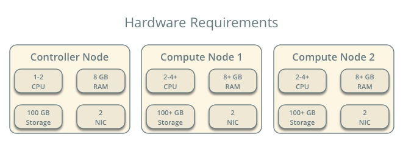
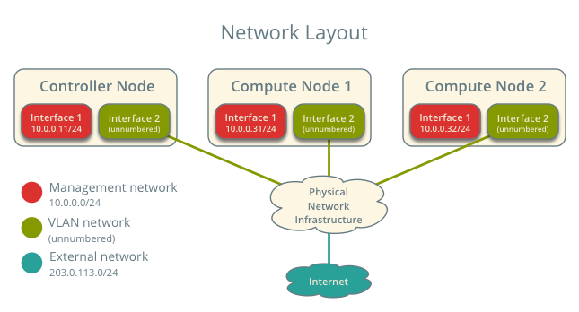
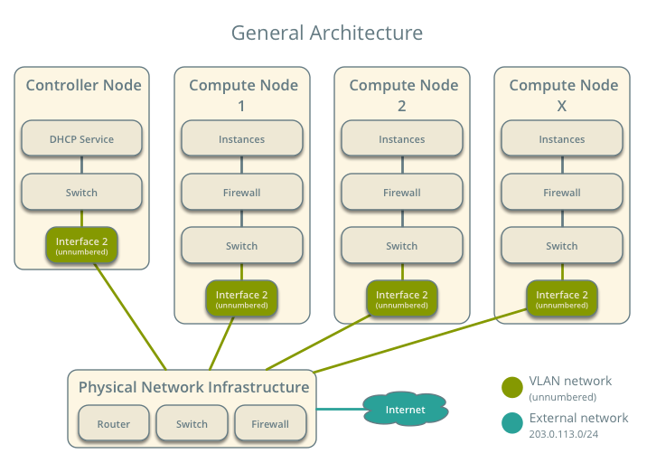
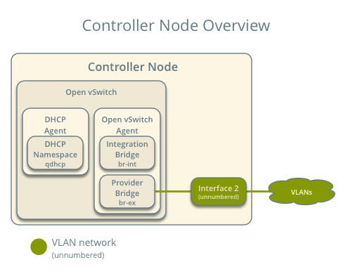
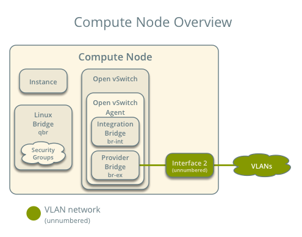
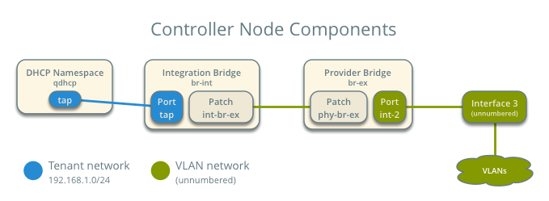
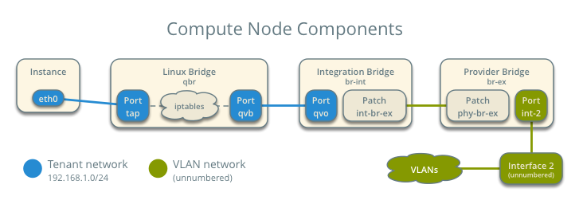
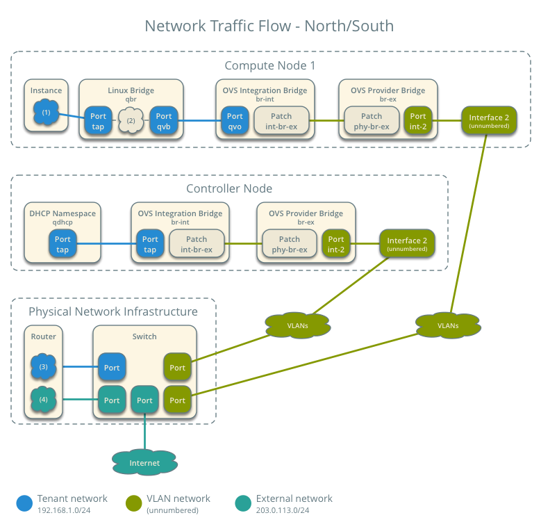
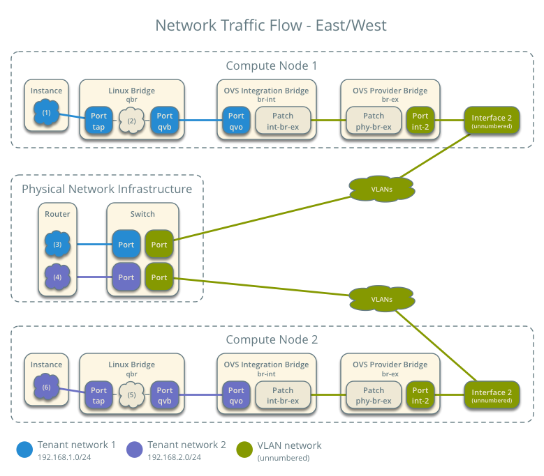

# Scenario: Provider networks with Open vSwitch

This scenario describes a basic implementation of OpenStack
Networking, where the networking service integrates with legacy
networks and physical hardware. The cases in which the provider
networking extension would be required consist of, but are not limited
to the following:

* Deploying a new cloud in a mixed environment

* High performance and reliability

* Simplicity

## Deploying a new cloud in a mixed environment

In some cases, an OpenStack deployment will be installed and networked
within a datacenter that already has a sizable network infrastructure
deployment, and the applications that run on top of the OpenStack
deployment may still need to interface with physical machines on the
same L2 network segment.

## Performance and reliability

Prior to the introduction of the Distributed Virtual Router feature in
OpenStack Networking, it was difficult to ensure the reliability of a
OpenStack Networking deployment since all traffic passed through a
dedicated network node. HA options did exist, but they were more
complex than relying on physical hardware.

Phsyical hardware switches and routers would also have better network performance
characteristics compared to most of the general purpose Linux machines
that OpenStack Networking would be installed on, which would also
contribute to the decision to use the provider networking extension.

## Simplicity

In many cases, operators are already familiar with the network
architecture of physical switches and routers. In many cases, it will
be faster to deploy the Network service, utilize the provider
networking extension to map physical networks to the cloud, then
slowly learn more about the Networking and how to operate it, and
design new architectures that can utilize the L3 features of the
Networking service in a future deployment.

# Requirements

1. One controller node with two network interfaces: management and
   external (typically the Internet). The Open vSwitch bridge `br-ex`
   must contain an port on the external interface.

1. At least two compute nodes with two network interfaces: management
   and external (typically the Internet). The Open vSwitch bridge `br-ex`
   must contain a port on the external interface.





## Prerequisites

1. Controller node

  1. Operational SQL server with `neutron` database and appropriate
     configuration in the neutron-server.conf file.

  1. Operational message queue service with appropriate configuration
     in the neutron-server.conf file.

  1. Operational OpenStack Identity service with appropriate configuration
     in the neutron-server.conf file.

  1. Operational OpenStack Compute controller/management service with
     appropriate configuration to use neutron in the nova.conf file.

  1. Neutron server service, Open vSwitch service, ML2 plug-in,
     Open vSwitch agent, DHCP agent, and any dependencies.

1. Compute nodes

  1. Operational OpenStack Identity service with appropriate configuration
     in the neutron-server.conf file.

  1. Operational OpenStack Compute controller/management service with
     appropriate configuration to use neutron in the nova.conf file.

  1. Open vSwitch service, ML2 plug-in, Open vSwitch agent, and any
     dependencies including the `ipset` utility.

## Architecture

### General

The general provider network architecture uses physical network
infrastructure to handle switching and routing of network traffic.



The network architecture for a provider networking from the OpenStack
perspective is fairly simple since the OpenStack cluster is being
"plugged in" to a provisioned and configured network that includes L2
and L3 connectivity. In a provider VLAN configuration, the hardware
switch that the OpenStack cluster is connected to already has
provisioned VLANs for the management/API network and public
Internet.

The controller node runs the Open vSwitch service, Open vSwitch agent,
and DHCP agent.



The compute node runs the Open vSwitch service and Open vSwitch agent.



### Components

The controller node contains the following components:

1. Open vSwitch agent managing virtual switches, connectivity among them,
   and interaction via virtual ports with other network components such as
   namespaces and underlying interfaces.

1. DHCP agent managing the `qdhcp` namespaces.

  1. The `dhcp` namespaces provide DHCP services for instances using
     provider networks.



The compute nodes contain the following components:

1. Open vSwitch agent managing virtual switches, connectivity among
   them, and interaction via virtual ports with other network components
   such as Linux bridges and underlying interfaces.

1. Linux bridges handling security groups.

  1. Due to limitations with Open vSwitch and *iptables*, the Networking
     service uses a Linux bridge to manage security groups for
     instances.



## Packet Flow

The flow of packets in a provider network scenario only contains
complexity inside the compute node's OVS networking. Neutron allocates
internal VLAN tags for each Neutron Network and provides a mapping
between the internal VLAN tag used for a Neutron network, and then
inserts rules in the Open vSwitch switching infrastructure to rewrite
the internal VLAN tag back to the VLAN tag that is allocated on the
hardware switch, as packets cross the br-ex device.

For all instances, the physical network infrastructure routes
*north-south* and *east-west* network traffic between provider networks.

Note: The term *north-south* generally defines network traffic that
travels between an instance and external network (typically the Internet)
and the term *east-west* generally defines network traffic that
travels between instances.

### Case 1: North-south



### Case 2: East-West



## Example configuration template

Use the following example configuration as a template to deploy this
scenario in your environment.

### Controller node (controller)

1. Configure base options.

   1. Edit the /etc/neutron/neutron.conf file.

    ```
    [DEFAULT]
    core_plugin = ml2
    service_plugins =

    notify_nova_on_port_status_changes = True
    notify_nova_on_port_data_changes = True
    nova_url = http://controller:8774/v2
    nova_region_name = regionOne
    nova_admin_username = NOVA_ADMIN_USERNAME
    nova_admin_tenant_id = NOVA_ADMIN_TENANT_ID
    nova_admin_password =  NOVA_ADMIN_PASSWORD
    nova_admin_auth_url = http://controller:35357/v2.0
    ```

  Note: Replace NOVA_ADMIN_USERNAME, NOVA_ADMIN_TENANT_ID, and
  NOVA_ADMIN_PASSWORD with suitable values for your environment.

1. Configure the ML2 plug-in.

  1. Edit the /etc/neutron/plugins/ml2/ml2_conf.ini file.

    ```
    [ml2]
    type_drivers = flat,vlan
    tenant_network_types =
    mechanism_drivers = openvswitch

    [ml2_type_flat]
    flat_networks = external

    [ml2_type_vlan]
    network_vlan_ranges = external

    [securitygroup]
    firewall_driver = neutron.agent.linux.iptables_firewall.OVSHybridIptablesFirewallDriver
    enable_security_group = True
    enable_ipset = True

    [ovs]
    bridge_mappings = external:br-ex
    ```

1. Configure the DHCP agent.

  1. Edit the /etc/neutron/dhcp_agent.ini file.

    ```
    [DEFAULT]
    verbose = True
    interface_driver = neutron.agent.linux.interface.OVSInterfaceDriver
    dhcp_driver = neutron.agent.linux.dhcp.Dnsmasq
    use_namespaces = True
    dhcp_delete_namespaces = True
    ```

1. Start the following services:

   * Server
   * Open vSwitch
   * Open vSwitch agent
   * DHCP agent

### Compute nodes (compute1 and compute2)

The compute nodes provide switching services and handle security groups
for instances.

1. Configure base options.

   1. Edit the /etc/neutron/neutron.conf file.

    ```
    [DEFAULT]
    core_plugin = ml2
    service_plugins =
    ```

1. Configure the ML2 plug-in.

  1. Edit the /etc/neutron/plugins/ml2/ml2_conf.ini file.

    ```
    [ml2]
    type_drivers = flat,vlan
    tenant_network_types =
    mechanism_drivers = openvswitch

    [ml2_type_flat]
    flat_networks = external

    [ml2_type_vlan]
    network_vlan_ranges = external

    [securitygroup]
    firewall_driver = neutron.agent.linux.iptables_firewall.OVSHybridIptablesFirewallDriver
    enable_security_group = True
    enable_ipset = True

    [ovs]
    bridge_mappings = external:br-ex
    ```

1. Start the following services:

   * Open vSwitch
   * Open vSwitch agent

### Verify service operation

1. Source the administrative tenant credentials.

1. Verify presence and operation of the agents.

   ```
   $ neutron agent-list
   +--------------------------------------+--------------------+------------+-------+----------------+---------------------------+
   | id                                   | agent_type         | host       | alive | admin_state_up | binary                    |
   +--------------------------------------+--------------------+------------+-------+----------------+---------------------------+
   | 1c5eca1c-3672-40ae-93f1-6bde214fa303 | DHCP agent         | controller | :-)   | True           | neutron-dhcp-agent        |
   | 6129b1ec-9946-4ec5-a4bd-460ca83a40cb | Open vSwitch agent | compute1   | :-)   | True           | neutron-openvswitch-agent |
   | 8a3fc26a-9268-416d-9d29-6d44f0e4a24f | Open vSwitch agent | compute2   | :-)   | True           | neutron-openvswitch-agent |
   +--------------------------------------+--------------------+------------+-------+----------------+---------------------------+
   ```

## Create initial networks

This example creates a provider network using VLAN 101 and IP network
203.0.113.0/24. Change the VLAN ID and IP network to values appropriate
for your environment.

### Provider network

1. Source the administrative tenant credentials.

1. Create a provider network.

   ```
   $ neutron net-create provnet-101 --shared \
     --provider:physical_network external --provider:network_type vlan \
     --provider:segmentation_id 101
   Created a new network:
   +---------------------------+--------------------------------------+
   | Field                     | Value                                |
   +---------------------------+--------------------------------------+
   | admin_state_up            | True                                 |
   | id                        | 8b868082-e312-4110-8627-298109d4401c |
   | name                      | provnet-101                          |
   | provider:network_type     | vlan                                 |
   | provider:physical_network | external                             |
   | provider:segmentation_id  | 101                                  |
   | router:external           | False                                |
   | shared                    | True                                 |
   | status                    | ACTIVE                               |
   | subnets                   |                                      |
   | tenant_id                 | e0bddbc9210d409795887175341b7098     |
   +---------------------------+--------------------------------------+
   ```

  Note: The `shared` option allows any tenants to use this network.

1. Create a subnet on the provider network.

   ```
   $ neutron subnet-create provnet-101 --allocation-pool \
     start=203.0.113.101,end=203.0.113.200 --gateway 203.0.113.1 \
     203.0.113.0/24
   Created a new subnet:
   +-------------------+----------------------------------------------------+
   | Field             | Value                                              |
   +-------------------+----------------------------------------------------+
   | allocation_pools  | {"start": "203.0.113.101", "end": "203.0.113.200"} |
   | cidr              | 203.0.113.0/24                                     |
   | dns_nameservers   |                                                    |
   | enable_dhcp       | True                                               |
   | gateway_ip        | 203.0.113.1                                        |
   | host_routes       |                                                    |
   | id                | 0443aeb0-1c6b-4d95-a464-c551c47a0a80               |
   | ip_version        | 4                                                  |
   | ipv6_address_mode |                                                    |
   | ipv6_ra_mode      |                                                    |
   | name              |                                                    |
   | network_id        | 8b868082-e312-4110-8627-298109d4401c               |
   | tenant_id         | e0bddbc9210d409795887175341b7098                   |
   +-------------------+----------------------------------------------------+
   ```

## Verify operation

1. On the controller node, verify creation of the `qdhcp` namespace. The
   `qdhcp` namespace might not exist until launching an instance.

  ```
  # ip netns
  qdhcp-8b868082-e312-4110-8627-298109d4401c
  ```

1. Source the regular tenant credentials.

1. Create the appropriate security group rules to allow ping and SSH access
   to the instance.

1. Launch an instance with an interface on the provider network.

1. On the controller node, ping the IP address associated with the
   instance.

  ```
  $ ping -c 4 203.0.113.102
  PING 203.0.113.102 (203.0.113.112) 56(84) bytes of data.
  64 bytes from 203.0.113.102: icmp_req=1 ttl=63 time=3.18 ms
  64 bytes from 203.0.113.102: icmp_req=2 ttl=63 time=0.981 ms
  64 bytes from 203.0.113.102: icmp_req=3 ttl=63 time=1.06 ms
  64 bytes from 203.0.113.102: icmp_req=4 ttl=63 time=0.929 ms

  --- 203.0.113.102 ping statistics ---
  4 packets transmitted, 4 received, 0% packet loss, time 3002ms
  rtt min/avg/max/mdev = 0.929/1.539/3.183/0.951 ms
  ```

1. Obtain access to the instance.

  1. Test connectivity to the Internet.

    ```
    $ ping -c 4 openstack.org
    PING openstack.org (174.143.194.225) 56(84) bytes of data.
    64 bytes from 174.143.194.225: icmp_req=1 ttl=53 time=17.4 ms
    64 bytes from 174.143.194.225: icmp_req=2 ttl=53 time=17.5 ms
    64 bytes from 174.143.194.225: icmp_req=3 ttl=53 time=17.7 ms
    64 bytes from 174.143.194.225: icmp_req=4 ttl=53 time=17.5 ms

    --- openstack.org ping statistics ---
    4 packets transmitted, 4 received, 0% packet loss, time 3003ms
    rtt min/avg/max/mdev = 17.431/17.575/17.734/0.143 ms
    ```

This work is licensed under the Creative Commons Attribution 4.0
International License. To view a copy of this license, visit
http://creativecommons.org/licenses/by/4.0/.
